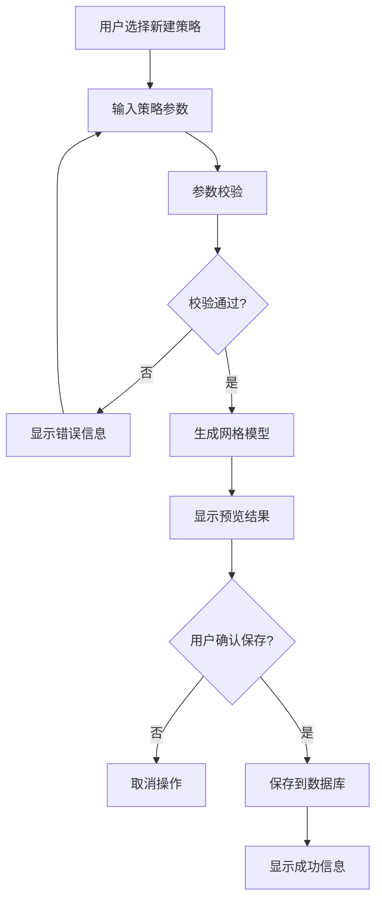
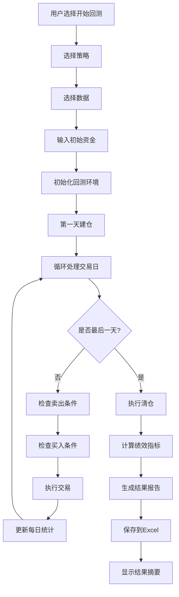
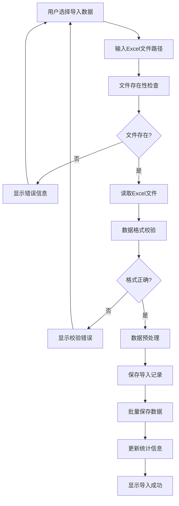

# 网格交易神器详细设计

## 1 系统架构设计

### 1.1 总体架构

```
┌─────────────────┐    ┌─────────────────┐    ┌─────────────────┐
│   CLI界面层     │    │   业务逻辑层     │    │   数据访问层     │
│                 │    │                 │    │                 │
│ - 用户交互      │    │ - 策略生成      │    │ - 数据库操作    │
│ - 菜单处理      │    │ - 回测引擎      │    │ - 数据导入      │
│ - 输入校验      │    │ - 绩效计算      │    │ - 模型定义      │
└─────────────────┘    └─────────────────┘    └─────────────────┘
         │                       │                       │
         └───────────────────────┼───────────────────────┘
                                 │
                    ┌─────────────────┐
                    │   数据存储层     │
                    │                 │
                    │ - SQLite数据库  │
                    │ - Excel文件     │
                    │ - JSON缓存      │
                    └─────────────────┘
```

### 1.2 技术架构

- **前端界面**：命令行界面（CLI）
- **后端逻辑**：Python纯代码实现
- **数据存储**：SQLite关系型数据库
- **数据处理**：Pandas + NumPy
- **文件处理**：OpenPyXL（Excel）、JSON
- **科学计算**：SciPy（优化算法）

## 2 模块详细设计

### 2.1 CLI模块（service/cli.py）

#### 2.1.1 功能描述

提供完整的命令行用户界面，实现用户与系统的所有交互功能。

#### 2.1.2 核心函数设计

##### run_cli()

```python
def run_cli() -> None:
    """
    主程序入口函数
    负责初始化数据库连接和主菜单循环
    """
    # 1. 初始化数据库
    if init_db() is None:
        print("数据库初始化失败")
        return

    # 2. 主菜单循环
    while True:
        clear_screen()
        display_main_menu()
        choice = get_user_choice()
        handle_menu_choice(choice)
```

##### handle_strategy_management()

```python
def handle_strategy_management() -> None:
    """
    策略管理子菜单处理
    提供新建、查看、删除策略的功能
    """
    menu_options = {
        '1': ('新建策略', handle_create_strategy),
        '2': ('查看已有策略', handle_view_strategies),
        '3': ('删除策略', handle_delete_strategy)
    }

    while True:
        display_submenu("策略管理", menu_options)
        choice = get_user_choice()
        if choice == 'b':
            break
        execute_menu_action(choice, menu_options)
```

##### handle_create_strategy()

```python
def handle_create_strategy() -> None:
    """
    新建策略流程
    1. 获取用户输入参数
    2. 生成网格模型
    3. 预览结果
    4. 保存到数据库
    """
    # 参数定义
    param_specs = [
        ("name", "策略名称", str, None, None, None),
        ("a", "波动捕捉大小参数a", float, 0.05, 0.30, 0.10),
        ("b", "每行收益率参数b", float, 0.05, 0.30, 0.10),
        ("first_trigger_price", "首个触发价", float, 0.0001, None, 1.000),
        ("total_rows", "总行数", int, 1, None, 5),
        ("buy_amount", "每次买入金额", float, 0.01, None, 10000.0)
    ]

    # 获取参数
    params = {}
    for param_name, prompt, type_func, min_val, max_val, default in param_specs:
        params[param_name] = input_with_validation(prompt, type_func, min_val, max_val, default)

    # 生成网格
    result = generate_grid_from_input(params)

    # 预览
    print_structured_grid_result(result["rows"])

    # 保存确认
    if confirm_action("是否保存该策略？"):
        save_grid_to_db(result)
        print("策略已保存")
    else:
        print("策略未保存")
```

#### 2.1.3 数据流图

```
用户输入 → 输入校验 → 业务处理 → 结果显示
    ↑           ↑         ↑         ↓
    └───────────┼─────────┼─────────┘
              异常处理 ← 错误捕获
```

### 2.2 策略生成模块（util/build_grid_model.py）

#### 2.2.1 功能描述

根据用户参数自动生成完整的网格交易策略模型。

#### 2.2.2 核心算法设计

##### generate_grid_from_input()

```python
def generate_grid_from_input(input_params: Dict[str, Any]) -> Dict[str, Any]:
    """
    网格生成核心算法

    参数:
    - name: 策略名称（可选）
    - a: 波动率参数 (0.05-0.30)
    - b: 收益率参数 (0.05-0.30)
    - first_trigger_price: 首行触发价
    - total_rows: 总行数
    - buy_amount: 每行买入金额

    返回:
    {
        "config": {...},  # 策略配置
        "rows": [...]     # 网格行数据
    }
    """

    # 1. 创建配置对象
    config = GridConfig(
        name=input_params.get("name"),
        a=input_params["a"],
        b=input_params["b"],
        first_trigger_price=input_params["first_trigger_price"],
        total_rows=input_params["total_rows"],
        buy_amount=input_params["buy_amount"]
    )

    # 2. 生成网格行
    rows = []
    for row_index in range(1, input_params["total_rows"] + 1):
        row_data = calculate_grid_row(input_params, row_index)
        row = GridRow(**row_data)
        rows.append(row)

    # 3. 建立关联
    config.rows = rows

    # 4. 返回结构化数据
    return {
        "config": config.to_dict(),
        "rows": [row.to_dict() for row in rows]
    }
```

##### calculate_grid_row()

```python
def calculate_grid_row(params: Dict, row_index: int) -> Dict[str, Any]:
    """
    计算单个网格行的所有参数

    算法步骤:
    1. 计算档位比例: level_ratio = previous_level / (1 + a/2)
    2. 计算买入触发价: buy_trigger = first_price * level_ratio
    3. 计算买入价: buy_price = buy_trigger - 0.005 (滑点)
    4. 计算卖出价: sell_price = buy_price * (1 + b)
    5. 计算卖出触发价: sell_trigger = sell_price - 0.005 (滑点)
    6. 计算买入股数: shares = floor(buy_amount / buy_price)
    7. 计算预期收益: profit = buy_amount * b
    """

    # 获取参数
    a = params["a"]
    b = params["b"]
    first_trigger = params["first_trigger_price"]
    buy_amount = params["buy_amount"]

    # 计算档位比例
    if row_index == 1:
        level_ratio = 1.0
    else:
        level_ratio = pow(1 + a/2, 1 - row_index)  # 等比数列

    # 计算价格
    buy_trigger_price = first_trigger * level_ratio
    buy_price = buy_trigger_price - 0.005  # 买入滑点
    sell_price = buy_price * (1 + b)
    sell_trigger_price = sell_price - 0.005  # 卖出滑点

    # 计算股数和收益
    shares = math.floor(buy_amount / buy_price)
    profit_amount = buy_amount * b
    fall_percent = (1 - level_ratio) * 100

    return {
        "fall_percent": fall_percent,
        "level_ratio": level_ratio,
        "buy_trigger_price": buy_trigger_price,
        "buy_price": buy_price,
        "buy_amount": buy_amount,
        "shares": shares,
        "sell_trigger_price": sell_trigger_price,
        "sell_price": sell_price,
        "yield_rate": b,
        "profit_amount": profit_amount
    }
```

#### 2.2.3 数据结构定义

##### GridConfig类

```python
class GridConfig(Base):
    __tablename__ = 'grid_configs'

    id = Column(Integer, primary_key=True, autoincrement=True)
    name = Column(String(100), nullable=True)
    a = Column(Float, nullable=False)  # 波动率参数
    b = Column(Float, nullable=False)  # 收益率参数
    first_trigger_price = Column(Float, nullable=False)
    total_rows = Column(Integer, nullable=False)
    buy_amount = Column(Float, nullable=False)
    last_modified = Column(DateTime, default=datetime.now)

    # 关联
    rows = relationship("GridRow", back_populates="config", cascade="all, delete-orphan")
```

##### GridRow类

```python
class GridRow(Base):
    __tablename__ = 'grid_rows'

    id = Column(Integer, primary_key=True, autoincrement=True)
    config_id = Column(Integer, ForeignKey('grid_configs.id'), nullable=False)

    # 技术参数
    fall_percent = Column(Float, nullable=False)      # 跌幅百分比
    level_ratio = Column(Float, nullable=False)       # 档位比例

    # 买入参数
    buy_trigger_price = Column(Float, nullable=False) # 买入触发价
    buy_price = Column(Float, nullable=False)         # 实际买入价
    buy_amount = Column(Float, nullable=False)        # 买入金额
    shares = Column(Float, nullable=False)            # 买入股数

    # 卖出参数
    sell_trigger_price = Column(Float, nullable=False) # 卖出触发价
    sell_price = Column(Float, nullable=False)         # 实际卖出价
    yield_rate = Column(Float, nullable=False)         # 收益率
    profit_amount = Column(Float, nullable=False)      # 预期盈利

    # 关联
    config = relationship("GridConfig", back_populates="rows")
```

### 2.3 回测引擎模块（util/backtest.py）

#### 2.3.1 功能描述

实现完整的网格交易回测逻辑，包括交易模拟、资金管理和绩效计算。

#### 2.3.2 BackTest类设计

##### 初始化方法

```python
class BackTest:
    def __init__(self, grid_data: List[Dict], grid_strategy: List[Dict], initial_capital: Optional[float] = None):
        """
        初始化回测环境

        参数:
        - grid_data: 历史行情数据列表
        - grid_strategy: 网格策略行数据
        - initial_capital: 初始资金（可选，默认等于策略总金额）
        """

        # 数据验证
        self._validate_input_data(grid_data, grid_strategy)

        # 设置基础参数
        self.grid_data = grid_data
        self.grid_strategy = grid_strategy
        self.initial_capital = self._calculate_initial_capital(initial_capital)

        # 初始化状态
        self.cash_balance = self.initial_capital
        self.max_cash_used = 0.0
        self.cash_used = 0.0

        # 持仓管理
        self.positions = self._initialize_positions()

        # 统计数据
        self.operate = []  # 交易记录
        self.daily_records = []  # 每日快照
        self.series_assert_holdings = []  # 持仓市值序列

        # 计数器
        self.sell_num = 0
        self.buy_num = 0
        self.buy_fail_num = 0
        self.triggered_rows = 0
        self.triggered_set = set()
```

##### 核心回测逻辑

```python
def run_backtest(self) -> Dict[str, Any]:
    """
    执行完整回测流程

    返回:
    {
        "df_trades": DataFrame,    # 交易流水
        "df_daily": DataFrame,     # 每日快照
        "metrics": Dict           # 绩效指标
    }
    """

    # 1. 第一天建仓
    self._process_first_day()

    # 2. 处理中间交易日
    for day_index in range(1, len(self.grid_data) - 1):
        self._process_trading_day(day_index)

    # 3. 最后一天清仓
    self._process_last_day()

    # 4. 生成结果
    return self._generate_results()
```

##### 每日处理逻辑

```python
def _process_trading_day(self, day_index: int) -> None:
    """
    处理单个交易日的买卖逻辑

    步骤:
    1. 获取当日价格数据
    2. 检查所有网格行的卖出条件
    3. 检查所有网格行的买入条件
    4. 执行允许的交易
    5. 更新每日统计
    """

    current_data = self.grid_data[day_index]
    date = current_data['date']
    prices = self._extract_prices(current_data)

    # 卖出检查（优先处理卖出）
    for strategy in self.grid_strategy:
        if self._should_sell(date, prices, strategy):
            self._execute_sell(date, prices, strategy)

    # 买入检查
    for strategy in self.grid_strategy:
        if self._should_buy(date, prices, strategy):
            self._execute_buy(date, prices, strategy)

    # 更新每日快照
    self._update_daily_snapshot(date, prices)
```

##### 买卖条件判断

```python
def _should_buy(self, date: str, prices: Dict, strategy: Dict) -> bool:
    """
    判断是否应该买入

    条件:
    1. 价格区间触及买入触发价: low <= buy_trigger <= high
    2. 买入价在当日区间内: low <= buy_price <= high
    3. 持仓状态允许买入: 空仓或已卖出
    4. 非同日交易限制
    5. 资金充足
    """
    buy_trigger = strategy['buy_trigger_price']
    buy_price = strategy['buy_price']
    strategy_id = strategy['id']

    # 价格条件
    price_condition = (prices['low'] <= buy_trigger <= prices['high'] and
                      prices['low'] <= buy_price <= prices['high'])

    # 持仓条件
    position_condition = self.check_positions(date, "买入", buy_trigger, strategy_id)

    # 资金条件
    cash_condition = self.cash_balance >= strategy['buy_amount']

    return price_condition and position_condition and cash_condition

def _should_sell(self, date: str, prices: Dict, strategy: Dict) -> bool:
    """
    判断是否应该卖出

    条件:
    1. 价格区间触及卖出触发价: low <= sell_trigger <= high
    2. 卖出价在当日区间内: low <= sell_price <= high
    3. 持仓状态允许卖出: 已买入且非同日
    """
    sell_trigger = strategy['sell_trigger_price']
    sell_price = strategy['sell_price']
    strategy_id = strategy['id']

    # 价格条件
    price_condition = (prices['low'] <= sell_trigger <= prices['high'] and
                      prices['low'] <= sell_price <= prices['high'])

    # 持仓条件
    position_condition = self.check_positions(date, "卖出", sell_trigger, strategy_id)

    return price_condition and position_condition
```

#### 2.3.3 绩效指标计算

##### XIRR计算

```python
def compute_xirr(self, df_trades: pd.DataFrame, df_daily: pd.DataFrame) -> Optional[float]:
    """
    计算策略内部收益率

    算法:
    1. 收集所有现金流（买入为负，卖出为正）
    2. 按时间排序
    3. 使用牛顿法求解XIRR方程
    """
    # 提取交易现金流
    cashflows = []
    dates = []

    for _, trade in df_trades.iterrows():
        if trade['action'] == '买入':
            cashflows.append(-trade['amount'])
            dates.append(pd.to_datetime(trade['date']))
        elif trade['action'] == '卖出':
            cashflows.append(trade['amount'])
            dates.append(pd.to_datetime(trade['date']))

    if len(cashflows) < 2:
        return None

    # 排序并求解
    cf_df = pd.DataFrame({'date': dates, 'cf': cashflows})
    cf_df = cf_df.sort_values('date')

    try:
        xirr = self.xirr(cf_df['cf'].values, cf_df['date'].values)
        return xirr if not np.isnan(xirr) else None
    except:
        return None
```

##### 最大回撤计算

```python
def max_drawdown_from_peak(self, prices: pd.Series) -> Optional[float]:
    """
    计算最大回撤（相对峰值）

    算法:
    1. 计算累积最大值序列
    2. 计算每个点位的回撤率: (price - peak) / peak
    3. 取最小回撤率（绝对值最大）
    """
    if prices.empty:
        return None

    rolling_max = prices.cummax()
    drawdown = (prices - rolling_max) / rolling_max
    return drawdown.min()  # 最小值即最大回撤
```

##### 夏普比率计算

```python
def compute_sharpe_from_daily(self, df_daily: pd.DataFrame,
                              value_col: str = "total_value",
                              periods_per_year: int = 252,
                              risk_free_rate_annual: float = 0.03) -> Optional[float]:
    """
    计算年化夏普比率

    公式: Sharpe = (Rp - Rf) / σp
    其中:
    - Rp: 策略年化收益率
    - Rf: 无风险利率
    - σp: 策略年化波动率
    """

    # 提取净值序列
    series = df_daily[value_col].astype(float).dropna()
    if len(series) < 2:
        return None

    # 计算日收益率
    returns = series.pct_change().dropna()

    # 计算超额收益
    rf_daily = (1 + risk_free_rate_annual) ** (1/252) - 1
    excess_returns = returns - rf_daily

    # 计算夏普比率
    mean_excess = excess_returns.mean()
    std_excess = excess_returns.std(ddof=1)

    if std_excess == 0:
        return None

    sharpe_daily = mean_excess / std_excess
    sharpe_annual = sharpe_daily * np.sqrt(periods_per_year)

    return float(sharpe_annual)
```

### 2.4 数据管理模块（dao/）

#### 2.4.1 数据库配置（config.py）

```python
# dao/config.py
import os
import sys

# 数据库路径配置
def get_database_path():
    """获取数据库文件路径"""
    if getattr(sys, 'frozen', False):
        # PyInstaller打包后的路径
        base_dir = os.path.dirname(sys.executable)
    else:
        # 开发环境路径
        base_dir = os.path.dirname(os.path.dirname(os.path.abspath(__file__)))

    db_dir = os.path.join(base_dir, 'data', 'database_folder')
    os.makedirs(db_dir, exist_ok=True)
    return os.path.join(db_dir, 'zombiegrid.db')

# 数据库URL
SQLALCHEMY_DATABASE_URI = f'sqlite:///{get_database_path()}'

# SQLAlchemy引擎配置
ENGINE_CONFIG = {
    'echo': False,  # 生产环境关闭SQL日志
    'pool_pre_ping': True,  # 连接前检查
    'connect_args': {
        'check_same_thread': False  # SQLite多线程支持
    }
}
```

#### 2.4.2 数据模型（grid_data_structure.py）

```python
# dao/grid_data_structure.py
from sqlalchemy import Column, Integer, String, Float, Date, ForeignKey, DateTime
from sqlalchemy.orm import relationship, declarative_base
from datetime import datetime

Base = declarative_base()

class BaseModel:
    """基础模型类"""
    def to_dict(self):
        """转换为字典"""
        data = {}
        for column in self.__table__.columns:
            value = getattr(self, column.name)
            if isinstance(value, datetime):
                data[column.name] = value.isoformat()
            else:
                data[column.name] = value
        return data

class GridConfig(Base, BaseModel):
    """网格策略配置表"""
    __tablename__ = 'grid_configs'

    id = Column(Integer, primary_key=True, autoincrement=True)
    name = Column(String(100), nullable=True, comment='策略名称')
    a = Column(Float, nullable=False, comment='波动率参数')
    b = Column(Float, nullable=False, comment='收益率参数')
    first_trigger_price = Column(Float, nullable=False, comment='首行触发价')
    total_rows = Column(Integer, nullable=False, comment='总行数')
    buy_amount = Column(Float, nullable=False, comment='每行买入金额')
    last_modified = Column(DateTime, default=datetime.now, comment='最后修改时间')

    # 关联关系
    rows = relationship("GridRow", back_populates="config",
                       cascade="all, delete-orphan", lazy='select')

class GridRow(Base, BaseModel):
    """网格行数据表"""
    __tablename__ = 'grid_rows'

    id = Column(Integer, primary_key=True, autoincrement=True)
    config_id = Column(Integer, ForeignKey('grid_configs.id'), nullable=False)

    # 技术指标
    fall_percent = Column(Float, nullable=False, comment='跌幅百分比')
    level_ratio = Column(Float, nullable=False, comment='档位比例')

    # 买入参数
    buy_trigger_price = Column(Float, nullable=False, comment='买入触发价')
    buy_price = Column(Float, nullable=False, comment='实际买入价')
    buy_amount = Column(Float, nullable=False, comment='买入金额')
    shares = Column(Float, nullable=False, comment='买入股数')

    # 卖出参数
    sell_trigger_price = Column(Float, nullable=False, comment='卖出触发价')
    sell_price = Column(Float, nullable=False, comment='实际卖出价')
    yield_rate = Column(Float, nullable=False, comment='收益率')
    profit_amount = Column(Float, nullable=False, comment='预期盈利金额')

    # 关联关系
    config = relationship("GridConfig", back_populates="rows")

class ImportedFiles(Base, BaseModel):
    """导入文件记录表"""
    __tablename__ = 'imported_files'

    id = Column(Integer, primary_key=True, autoincrement=True)
    file_name = Column(String(255), nullable=True, comment='原始文件名')
    index_code = Column(String(50), nullable=False, comment='指数代码')
    record_count = Column(Integer, nullable=True, comment='数据记录数')
    date_range = Column(String(100), nullable=True, comment='日期范围')

    # 关联关系
    data_records = relationship("IndexData", back_populates="import_file",
                               cascade="all, delete-orphan", lazy='select')

class IndexData(Base, BaseModel):
    """指数行情数据表"""
    __tablename__ = 'index_data'

    id = Column(Integer, primary_key=True, autoincrement=True)
    import_id = Column(Integer, ForeignKey('imported_files.id'), nullable=False)

    # 基本信息
    date = Column(Date, nullable=False, comment='交易日期')
    index_code = Column(String(50), nullable=False, comment='指数代码')

    # 价格数据
    open_price = Column(Float, nullable=False, comment='开盘价')
    high_price = Column(Float, nullable=False, comment='最高价')
    low_price = Column(Float, nullable=False, comment='最低价')
    close_price = Column(Float, nullable=False, comment='收盘价')
    change_percent = Column(Float, nullable=False, comment='涨跌幅(%)')

    # 关联关系
    import_file = relationship("ImportedFiles", back_populates="data_records")
```

#### 2.4.3 数据库会话管理（db_function_library.py）

```python
# dao/db_function_library.py
from sqlalchemy import create_engine
from sqlalchemy.orm import sessionmaker, Session
from sqlalchemy.exc import SQLAlchemyError
from contextlib import contextmanager
from typing import Optional, List, Dict, Any
from .config import SQLALCHEMY_DATABASE_URI, ENGINE_CONFIG

class DBSessionManager:
    """数据库会话管理器"""

    def __init__(self, db_url: str = SQLALCHEMY_DATABASE_URI):
        self.db_url = db_url
        self.engine = None
        self.SessionLocal = None
        self._initialize_engine()

    def _initialize_engine(self):
        """初始化数据库引擎"""
        try:
            self.engine = create_engine(self.db_url, **ENGINE_CONFIG)
            self.SessionLocal = sessionmaker(autocommit=False, autoflush=False, bind=self.engine)
        except Exception as e:
            raise RuntimeError(f"数据库引擎初始化失败: {e}")

    @contextmanager
    def session_scope(self):
        """提供事务范围的会话"""
        session = self.SessionLocal()
        try:
            yield session
            session.commit()
        except Exception as e:
            session.rollback()
            raise e
        finally:
            session.close()

    def __enter__(self) -> Session:
        """上下文管理器入口"""
        self._session = self.SessionLocal()
        return self._session

    def __exit__(self, exc_type, exc_val, exc_tb):
        """上下文管理器出口"""
        try:
            if exc_type:
                self._session.rollback()
            else:
                self._session.commit()
        finally:
            self._session.close()

    def execute_query(self, query: str, params: Optional[Dict] = None) -> List[Dict]:
        """执行原生SQL查询"""
        with self.session_scope() as session:
            result = session.execute(query, params or {})
            return [dict(row) for row in result]

    def execute_update(self, query: str, params: Optional[Dict] = None) -> int:
        """执行原生SQL更新"""
        with self.session_scope() as session:
            result = session.execute(query, params or {})
            return result.rowcount

    # 策略管理方法
    def save_grid_config(self, config_data: Dict) -> int:
        """保存网格配置"""
        from .grid_data_structure import GridConfig, GridRow

        with self.session_scope() as session:
            # 创建配置
            config = GridConfig(**config_data['config'])
            session.add(config)
            session.flush()  # 获取ID

            # 创建行数据
            for row_data in config_data['rows']:
                row_data['config_id'] = config.id
                row = GridRow(**row_data)
                session.add(row)

            return config.id

    def get_grid_configs(self) -> List[Dict]:
        """获取所有策略配置"""
        from .grid_data_structure import GridConfig

        with self.session_scope() as session:
            configs = session.query(GridConfig).order_by(GridConfig.id).all()
            return [config.to_dict() for config in configs]

    def delete_strategy_by_id(self, strategy_id: int) -> bool:
        """删除策略及其所有相关数据"""
        from .grid_data_structure import GridConfig

        try:
            with self.session_scope() as session:
                config = session.query(GridConfig).filter(GridConfig.id == strategy_id).first()
                if config:
                    session.delete(config)  # 级联删除
                    return True
                return False
        except SQLAlchemyError:
            return False

    # 数据管理方法
    def save_import_record(self, file_info: Dict) -> int:
        """保存导入文件记录"""
        from .grid_data_structure import ImportedFiles

        with self.session_scope() as session:
            record = ImportedFiles(**file_info)
            session.add(record)
            session.flush()
            return record.id

    def save_index_data_batch(self, import_id: int, data_batch: List[Dict]) -> int:
        """批量保存指数数据"""
        from .grid_data_structure import IndexData

        with self.session_scope() as session:
            count = 0
            for data in data_batch:
                data['import_id'] = import_id
                record = IndexData(**data)
                session.add(record)
                count += 1
            return count

    def get_imported_files(self) -> List[Dict]:
        """获取所有导入文件记录"""
        from .grid_data_structure import ImportedFiles

        with self.session_scope() as session:
            files = session.query(ImportedFiles).order_by(ImportedFiles.id).all()
            return [file.to_dict() for file in files]

    def delete_import_batch(self, import_id: int) -> bool:
        """删除导入批次及其数据"""
        from .grid_data_structure import ImportedFiles

        try:
            with self.session_scope() as session:
                file_record = session.query(ImportedFiles).filter(ImportedFiles.id == import_id).first()
                if file_record:
                    session.delete(file_record)  # 级联删除
                    return True
                return False
        except SQLAlchemyError:
            return False

    def get_index_data_by_import_id(self, import_id: int) -> List[Dict]:
        """获取指定导入批次的数据"""
        from .grid_data_structure import IndexData

        with self.session_scope() as session:
            records = session.query(IndexData).filter(
                IndexData.import_id == import_id
            ).order_by(IndexData.date).all()
            return [record.to_dict() for record in records]

    def close(self):
        """关闭数据库连接"""
        if self.engine:
            self.engine.dispose()
```

#### 2.4.4 数据导入器（data_importer.py）

```python
# dao/data_importer.py
import pandas as pd
import os
from datetime import datetime
from typing import Dict, List, Tuple, Optional
from .db_function_library import DBSessionManager
from .config import SQLALCHEMY_DATABASE_URI

class DataImporter:
    """数据导入器"""

    def __init__(self, db_url: str = SQLALCHEMY_DATABASE_URI):
        self.db_manager = DBSessionManager(db_url)

    def import_market_data_from_excel(self, excel_path: str, original_filename: str) -> bool:
        """
        从Excel文件导入市场数据

        步骤:
        1. 读取Excel文件
        2. 数据预处理和校验
        3. 保存导入记录
        4. 批量保存数据
        5. 更新统计信息
        """

        try:
            # 1. 读取数据
            df = self._read_excel_file(excel_path)

            # 2. 数据校验
            self._validate_data_format(df)

            # 3. 数据预处理
            processed_data = self._preprocess_data(df)

            # 4. 保存到数据库
            import_id = self._save_import_data(processed_data, original_filename)

            return import_id is not None

        except Exception as e:
            print(f"数据导入失败: {e}")
            return False

    def _read_excel_file(self, file_path: str) -> pd.DataFrame:
        """读取Excel文件"""
        if not os.path.exists(file_path):
            raise FileNotFoundError(f"文件不存在: {file_path}")

        # 读取第一个工作表
        df = pd.read_excel(file_path, engine='openpyxl')

        # 检查必要列
        required_columns = ['Date', 'Index Code', 'Open', 'High', 'Low', 'Close', 'Change(%)']
        missing_columns = [col for col in required_columns if col not in df.columns]
        if missing_columns:
            raise ValueError(f"缺少必要列: {missing_columns}")

        return df

    def _validate_data_format(self, df: pd.DataFrame) -> None:
        """数据格式校验"""
        # 检查数据类型
        if df.empty:
            raise ValueError("Excel文件为空")

        # 检查日期格式
        try:
            pd.to_datetime(df['Date'], format='%Y%m%d')
        except:
            raise ValueError("日期格式错误，应为YYYYMMDD格式")

        # 检查数值列
        numeric_columns = ['Open', 'High', 'Low', 'Close', 'Change(%)']
        for col in numeric_columns:
            if not pd.api.types.is_numeric_dtype(df[col]):
                raise ValueError(f"列 {col} 必须为数值类型")

    def _preprocess_data(self, df: pd.DataFrame) -> Dict[str, Any]:
        """数据预处理"""
        # 转换日期格式
        df['Date'] = pd.to_datetime(df['Date'], format='%Y%m%d').dt.date

        # 获取基本信息
        index_code = df['Index Code'].iloc[0]
        date_range = f"{df['Date'].min()} ~ {df['Date'].max()}"
        record_count = len(df)

        # 转换为字典列表
        data_records = []
        for _, row in df.iterrows():
            record = {
                'date': row['Date'],
                'index_code': row['Index Code'],
                'open_price': float(row['Open']),
                'high_price': float(row['High']),
                'low_price': float(row['Low']),
                'close_price': float(row['Close']),
                'change_percent': float(row['Change(%)'])
            }
            data_records.append(record)

        return {
            'file_info': {
                'file_name': None,  # 将在调用处设置
                'index_code': index_code,
                'record_count': record_count,
                'date_range': date_range
            },
            'data_records': data_records
        }

    def _save_import_data(self, processed_data: Dict, original_filename: str) -> Optional[int]:
        """保存数据到数据库"""
        file_info = processed_data['file_info']
        file_info['file_name'] = original_filename

        # 保存导入记录
        import_id = self.db_manager.save_import_record(file_info)
        if not import_id:
            return None

        # 批量保存数据（分批处理，避免内存溢出）
        data_records = processed_data['data_records']
        batch_size = 1000

        for i in range(0, len(data_records), batch_size):
            batch = data_records[i:i + batch_size]
            self.db_manager.save_index_data_batch(import_id, batch)

        return import_id

    def import_grid_model(self, model_data: Dict) -> bool:
        """导入网格模型数据"""
        try:
            config_id = self.db_manager.save_grid_config(model_data)
            return config_id is not None
        except Exception as e:
            print(f"网格模型导入失败: {e}")
            return False

    def close(self):
        """关闭连接"""
        self.db_manager.close()
```

## 3 业务流程设计

### 3.1 策略创建流程



### 3.2 回测执行流程



### 3.3 数据导入流程



## 4 错误处理设计

### 4.1 输入验证

```python
def input_with_validation(prompt: str, type_func, min_val=None, max_val=None, default=None):
    """
    带验证的用户输入函数

    参数:
    - prompt: 输入提示
    - type_func: 类型转换函数 (int, float, str)
    - min_val/max_val: 数值范围
    - default: 默认值

    返回: 验证通过的值或'b'(取消)
    """
    while True:
        try:
            user_input = input(prompt).strip()

            # 检查取消操作
            if user_input.lower() == 'b':
                return 'b'

            # 使用默认值
            if not user_input and default is not None:
                value = default
            else:
                value = type_func(user_input)

            # 范围检查
            if min_val is not None and value < min_val:
                print(f"值不能小于 {min_val}")
                continue
            if max_val is not None and value > max_val:
                print(f"值不能大于 {max_val}")
                continue

            return value

        except ValueError:
            if type_func == int:
                print("请输入有效的整数")
            elif type_func == float:
                print("请输入有效的数字")
            else:
                print("输入无效")
```

### 4.2 异常处理策略

```python
def safe_execute(func, *args, **kwargs):
    """
    安全执行函数，统一异常处理

    策略:
    1. 捕获所有异常
    2. 记录错误信息
    3. 提供用户友好的提示
    4. 确保程序稳定运行
    """
    try:
        return func(*args, **kwargs)
    except KeyboardInterrupt:
        print("\n用户中断操作")
        return None
    except Exception as e:
        error_msg = f"操作执行失败: {str(e)}"
        print(error_msg)

        # 记录详细错误（开发环境）
        if os.getenv('DEBUG', '').lower() == 'true':
            import traceback
            traceback.print_exc()

        return None
```

### 4.3 数据一致性保证

- **事务管理**: 所有数据库操作使用事务
- **级联删除**: 保证外键约束的完整性
- **回滚机制**: 操作失败时自动回滚
- **数据校验**: 导入前进行完整性检查

## 5 配置管理设计

### 5.1 环境配置

```python
# config.py
import os

class Config:
    """配置管理类"""

    # 数据库配置
    DATABASE_DIR = os.path.join(os.path.dirname(__file__), 'data', 'database_folder')
    DATABASE_NAME = 'zombiegrid.db'
    DATABASE_URL = f'sqlite:///{os.path.join(DATABASE_DIR, DATABASE_NAME)}'

    # 回测配置
    DEFAULT_INITIAL_CAPITAL = None  # None表示自动计算
    DEFAULT_RISK_FREE_RATE = 0.03   # 年化无风险利率
    TRADING_DAYS_PER_YEAR = 252     # 年交易日数

    # 滑点配置
    BUY_SLIPPAGE = 0.005    # 买入滑点
    SELL_SLIPPAGE = 0.005   # 卖出滑点

    # UI配置
    PAGE_SIZE = 20          # 分页大小
    MAX_RETRIES = 3         # 最大重试次数
    TIMEOUT = 30            # 超时时间(秒)

    @classmethod
    def init_app(cls):
        """应用初始化"""
        os.makedirs(cls.DATABASE_DIR, exist_ok=True)

# 全局配置实例
config = Config()
```

### 5.2 路径管理
